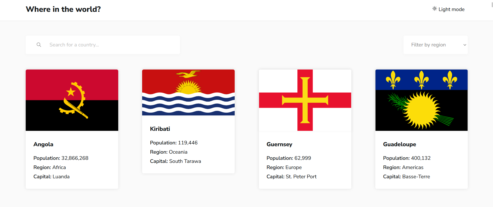

# REST Countries API 

## Table of contents

- [Overview](#overview)
  - [Screenshot](#screenshot)
  - [Link](#link)
- [My process](#my-process)
  - [Built with](#built-with)
  - [Continued development](#continued-development)
- [Author](#author)

## Overview

The website is displaying list of coutries, their details and flags. It uses data from [REST Countries](https://restcountries.com/)

Key features
- see all the countries on the homepage
- search for a coutry using an `input` field
- filter countries by region
- click on a coutry to see more detailed information on a separate page
- click through to the border countries on the detail page
- toggle the color scheme between light and dark mode
- use magnifier to see flag details

### Screenshot

### Link

- Live Site URL: [where-countries.netlify.app](where-countries.netlify.app)

### Built with

- [React](https://reactjs.org/) - JS library
- TypeScript
- Vite
- Axios - Promise-based HTTP client
- Framer Motion - for smooth animations
- [Image Magnifier](https://dev.to/anxiny/create-an-image-magnifier-with-react-3fd7).

### Continuous development

- UPDATE 1: using ThemeContext instead of prop drilling

## Author

- Website - [Hana Maruškevičová](https://www.hanamarus.cz)
- This is a solution to the [REST Countries API with color theme switcher challenge on Frontend Mentor](https://www.frontendmentor.io/challenges/rest-countries-api-with-color-theme-switcher-5cacc469fec04111f7b848ca)
